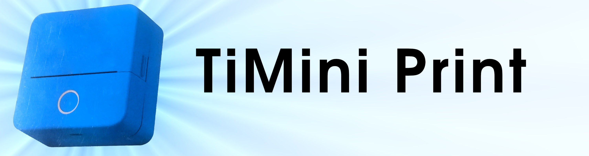

# TiMini Print Community
Alternative open-source [desktop software](https://github.com/Dejniel/TiMini-Print/releases) and an expanded commercial [TiMini Print mobile app](https://timiniprint.com/) for Chinese Bluetooth thermal printers that use proprietary protocols (not ESC/POS), as a replacement for apps like “Tiny Print”, “Fun Print”, “Funny Print”, “Dolewa”, “iBleem”, “Luck Jingle”, “Phomemo”, “Print Master”, “InstaPrint”, “ToPrint”, “Eleph-label”, or “NIIMBOT”, with additional “WalkPrint” and “Paperang” support in the mobile app.
It supports almost all mini printers! Check the huge list of [supported Bluetooth printer models](#supported-printer-models), or report missing ones.
TiMini Print lets you print images, PDFs, or plain text from your computer. It supports both a GUI and a “fire-and-forget” CLI mode, plus [custom integrations](#library-integration)

These printers are often sold on AliExpress and under generic names such as “thermal printer”, “mini printer”, or “cat printer”.
TiMini Print Community works on Windows, Linux, and macOS as a standalone tool without a system printer driver (it does not emulate a driver or print spooler). The [TiMini Print mobile app](https://timiniprint.com/) is available for Android.
Unlike similar projects, TiMini Print models printer behavior to match the original apps as closely as possible, down to the packet level

## Motivation
I bought a Chinese mini printer and could not find any decent desktop software that met my expectations, so I wrote my own. This is also the kind of work I do professionally. If you need help with a similar problem, you can [contact me](https://inajiffy.eu/) — I can also help with [broader support or custom implementation](#looking-for-broader-support-or-implementation)



# We need you!
- This project is open source! Your small monthly support on [Buy Me a Coffee](https://buymeacoffee.com/dejniel) can make a real difference and help keep it going—even a one-time donation helps. Building and maintaining a project like this takes a lot of time; if you find it useful, please consider supporting it so I can keep improving it: [support the project](https://buymeacoffee.com/dejniel)
- If you're a developer, contributions and bug reports are always welcome—please jump in. Especially if you use or build on non-Linux systems, please consider contributing fixes or improvements

## Looking for broader support or implementation?
- If you need security/reverse engineering, broader commercial support, or a custom implementation, feel free to [reach out](https://inajiffy.eu/). I work on broken systems, neglected integrations, and projects that are already end-of-life, unsupported — or simply unsupportable. I also handle custom implementation work that sits outside the usual support model

# Download
- **TiMini Print Community:** Download the free and open-source desktop GUI or CLI for Windows, Linux, and macOS from the [releases page](https://github.com/Dejniel/TiMini-Print/releases), or build it yourself using the instructions below
- **TiMini Print mobile app:** Offers a larger printer catalog while keeping printing offline. Get it from [timiniprint.com](https://timiniprint.com/) or directly from the [Google Play Store](https://play.google.com/store/apps/details?id=pl.wtrymiga.timiniprint)

I mainly test TiMini Print on Ubuntu-like systems and Android. Windows and macOS builds are available too, but if something breaks there, please report it or submit a fix :P

## Build from source
- Python 3.8+
- `pip install -r requirements.txt`
  - Windows + Python 3.13+: installing `winsdk` may require building binaries during download
  - (optional, GUI only) if `tkinter` is missing, install it from your system packages:
  Linux (Ubuntu/Debian): `sudo apt install python3-tk`
  macOS (Homebrew Python): `brew install python-tk`

# Quick start
If you use release binaries, run the downloaded executable directly.
If you build or run from source instead, use `python3 timiniprint_gui.py` or `python3 timiniprint_command_line.py`.

## Graphical user interface
You can scan, connect or disconnect with one button, choose a file, and print.
Start the graphical app by running the [downloaded executable file](#download).
On Linux, make sure it has execute permission first.

```bash
# Replace the filename below with the matching asset for your platform
chmod +x ./TiMini-Print-GUI-Linux-x86_64
./TiMini-Print-GUI-Linux-x86_64
```

Or run it from source:

```bash
python3 timiniprint_gui.py
```

## Command line interface
(the examples use Linux filenames)
- Print to the first supported Bluetooth printer:
  ```bash
  ./TiMini-Print-Command-Line-Linux-x86_64 /path/to/file.pdf
  ```

- Print to a specific Bluetooth printer:
  ```bash
  ./TiMini-Print-Command-Line-Linux-x86_64 --bluetooth "PRINTER_NAME" /path/to/file.pdf
  ```

- Print via a serial port (skip Bluetooth connection):
  ```bash
  ./TiMini-Print-Command-Line-Linux-x86_64 --export-printer-config luck_a2 printer.json
  ./TiMini-Print-Command-Line-Linux-x86_64 --serial /dev/rfcomm0 --printer-config printer.json /path/to/file.pdf
  ```

- Force a specific model for an unsupported or random Bluetooth name:
  ```bash
  ./TiMini-Print-Command-Line-Linux-x86_64 --list-models
  ./TiMini-Print-Command-Line-Linux-x86_64 --printer-model luck_a2 /path/to/file.pdf
  ```

- Print raw text without creating a file:
  ```bash
  ./TiMini-Print-Command-Line-Linux-x86_64 --text "Hello from CLI"
  ```

- List available printer models:
  ```bash
  ./TiMini-Print-Command-Line-Linux-x86_64 --list-models
  ```

- Scan for supported printers:
  ```bash
  ./TiMini-Print-Command-Line-Linux-x86_64 --scan
  ```

## Notes
- If `--bluetooth`, `--printer-model`, and `--printer-config` are omitted, the first supported printer found is used
- With `--printer-model` or `--printer-config`, `--bluetooth` is optional; without it, the first Bluetooth target found is used unless the printer config has a saved Bluetooth target
- Use `--bluetooth NAME_OR_ADDRESS` when several Bluetooth devices are nearby and you want to choose one explicitly
- For `--serial`, you must pass `--printer-model MODEL_KEY` or `--printer-config printer.json`
- `--printer-model KEY` uses a known model key directly; `--printer-config PATH` loads an editable printer config JSON
- `--export-printer-config KEY PATH` writes a full editable printer config JSON from a known model key or public model name
- The GUI and standalone CLI release builds check GitHub releases at startup at most once per day; set `TIMINIPRINT_NO_UPDATE_CHECK=1` to disable this

# Notes
- On first Classic connection on Windows/macOS, the system may request pairing confirmation

## Library integration
If you want to build your own integration instead of using only the bundled GUI or CLI, start with [docs/protocol.md](docs/protocol.md). It is the practical first-steps guide to resolving a `PrinterDevice`, connecting it, and printing through `ConnectedPrinter`. For package boundaries, continue with [docs/architecture.md](docs/architecture.md). For model/profile JSON data, read [docs/catalog.md](docs/catalog.md).

# Supported formats
- Images: .png .jpg .jpeg .gif .bmp
- PDF: prints all pages
- Text: .txt (monospace bold, word-wrapped by default)

# Supported printer models
The list below covers TiMini Print Community. The [TiMini Print mobile app](https://timiniprint.com/) supports every Community model plus additional “WalkPrint”, “Paperang”, and other printers.

<!-- BEGIN supported-models -->
A33, A40, A41III, A43, A4300, AI01, AN01, APA46Y, APA49H, D100, D110, DL_X2, DL_X7, DL_X7Pro, GB01, GB02, GB02SH, GB03SL, GB04, GB05, GT02, GT04, GW09, HD1, JXM800, Label Printer, LP100, LT01, LuckP_A41, LuckP_A42, LY01, LY02, LY03, LY05, LY10, LY11, M2, M220, Mini Printer, MPA81, MX02, MX03, MX07, MX08, MX09, MXW010, P1, P10, P4, P6, P7, PD01, PPA2L, PPA2LH, PR30, PR88, Professional Printer, PT001, QIRUI_Q1, QIRUI_Q2, S01, S101, S102, Shipping Printer, U1, U8, WQ02, X1, X101H, X5, X6, X7, X8, XW001, XW002, YTB01, ZHHC, ZP802, ZPA4Z1

- 15P3 and clones: YK06
- 58P5 and clones: WL01
- A2 and clones: A2_EY48D, A2_LYiN48D_ITSR, PPA2
- A2H and clones: A2_LYiN48DH, PPA2H
- A41II and clones: A42II, A200
- A80H-HD and clones: DP_A80H
- APA40 and clones: APA42, APA43
- APA41 and clones: E49, A49, APA49
- APL86HL and clones: L86H_Printer, APL86H
- BH-01 and clones: LX-D01, LX-D02, LX-D2, LX-D3, LX-D4, LX-D5, LX-D6, LX-D7, LX-D8, LX-D9, LX-D03, LX-D04, LX-D05, LX-D06, LX-D07, LX-D08, LX-D09
- BQ02 and clones: BQ03, BQ17
- CMT-0510 and clones: SC03, SC04, GV-MA211
- CTP-500 and clones: CorePrint, Teal Printer, Purple Printer, B Pink Printer, Cherry Printer, Floral Printer, Check Printer, Smiley Printer, Stone Printer, P Pink Printer, YHK
- D11 and clones: D11S
- D80 and clones: DP_D80, DP-D80, E80, CASA-01, PeriPage_A40, DYD80
- DL_X2Pro and clones: P5
- DYA49 and clones: ITP06, DP_ITP06, TPA46Pro
- DYD80H and clones: DP_D80H
- ewtto ET-Z0504 and clones: IM.04, X103H, SC05, X102, X5HP, X6HP, P7H, X2H, X5H, X6H, X7H
- FL01 and clones: KF-5
- GB03 and clones: GB06
- GB03PH and clones: GB03SH
- GT01 and clones: GT03
- GT08 and clones: GW08, XW005
- GT09 and clones: GT10
- IprintIt and clones: DY01, LP6
- ITP05H and clones: DYA46, ITP05, DP_ITP05, TPA46, DP_A4, DP-A4, DP_8038
- JX001 and clones: JX002, JX003, JX004, JX005, JX006
- L1 and clones: U2
- L86 and clones: L86_Printer, APL86
- LGM01 and clones: X7HP
- M02 and clones: Mr.in, Mr.in_M02
- M02 Pro and clones: M02PRO
- M02S and clones: Mr.in_M02S
- M02X and clones: M02D, M02E, MR2, M02A, KP-Q1
- M102 and clones: M120, Q306, Q481, Q485, Q009, Q244, Q451, Q592
- M108 and clones: M108_Z, M108TA, M109, M105, M110, M110S, M110R, Q042, Q045, Q061, Q062, Q194, Q431, Q437, Q120, Q524, Q593, Q043, Q317, M002, Q002, Q011, Q026, Q034, Q119, Q192, Q468
- M110 and clones: M120
- MINIPRINTER and clones: JL-BR22
- MV-B530 and clones: GL-VS9, QDID, X9
- MX05 and clones: MX06, MXTP-100, CYLOBTPRINTER, EWTTOET-Z0499
- MX10 and clones: AZ-P2108X, MXW009, KP-IM606, GV-MA211
- MX11 and clones: MX12
- MX13 and clones: XOPOPPY
- Orgstra S001 and clones: S001
- P11 and clones: P2, P5, YHK
- P5AI and clones: PR07, XW003, XW009, M01, AI01
- Pocket Printer and clones: Luxorp.PX10, EMX-040256, SeznikEcho, TCM690464, UXPORTMIP, DL_GE225, ML-MP-01, ROSSMANN, 0019B-C, 0019B-D, DTR-R0, GB03PL, HT0125, RT034h, DT1-0, SC03h, SC04h, X103h, DY03, X100, X2h, X5h, X6h, X7h, XC9, D1, X18, DT1-R, TD-11308, XC9-FL01, P1, P2
- PR02 and clones: XW008
- PR893 and clones: XW007
- SC03H and clones: FC02
- SeznikNeo and clones: RS9000, XiaoWa, JRX01, QDX01, wts07, CP01, DY49, S5A, P20 max, S9A, DY33A, YMS-BT01, WJ-HOT-PRT
- T02 and clones: T02E, Q02E, C02E
- V5X and clones: X1, X2, MXW01, MXW01-1, C17, MXW-W5, AC695X_PRINT, JK01, PORTABLEPRINTER, INSTANTPRINTPLUS, REKA, HDMDT-00, KERUI, BH03
- X16 and clones: Audio Print, A2, A3
- XW004 and clones: PR35
- YT01 and clones: YT02, MX01, MX05, MX06, MX08, MX09, MX10, MX11, MX12, MX13, MXTP-100, MXPC-100, AZ-P2108X, PD01, URBANWORXKIDSCAMERA, CYLOBTPRINTER, XOPOPPY, BQ01, EWTTOET-Z0499, BQ05, BQ95B, BQ95C, BQ95, BQ06B, BQ06, BQ07, BQ7A, BQ7B, BQ08, BQ96, MXW009, MXW010, EWTTOET-N3689, EWTTOET-N3687, KP-IM606, GV-MA211, X6, K06
- ZP801 and clones: XW006, PR89, X8-L, X8-W
<!-- END supported-models -->

## Potential future support
These models or protocol families are not in the supported list yet, but they look implementable with [more support](#we-need-you).
<!-- BEGIN todo-models -->
D110_M, DL-T1, GT08, GW08, Hi-D110, JX400R, JX400R06P, Label Printer, LX-P01, MP300, MXW-A4, P3, PM-201, Q02

- A30 and clones: Q294, Q295, Q574
- A80 and clones: A80H
- AL200 and clones: AL2, RPP02N
- B1 and clones: B1 Pro, M2_H, N1
- B18 and clones: B18S
- B21 and clones: B21-C2B, B21-L2B, B21S, B21S-C2B, B21_Pro
- B24 and clones: B3S, B3S_P, JCB3S, S6, S6_P
- B246D and clones: Q027, Q081, Q100, Q101, Q102, Q103
- BAYPAGE and clones: YINTIBAO-V8S
- BMW-M3 and clones: YCN-M3
- C21 and clones: D1, D2, E2, NEWSMY
- CoreLargePrint and clones: Pro Printer
- D101 and clones: Betty
- D11_H and clones: Hi-NB-D11, D61, D41, Dxx, Fust, D11_Pro
- D12 and clones: C2, PPC2, C3, LPC3, DP_ITP07, C16, MPC16, 15P3Pro
- D1600 and clones: D1600D, Q175, Q176
- D30 and clones: D35, D50, Q30, Q30S, D30S, D30S New, D30S Pro, D30N, D30Pro, D20, D10, D30AT, CNL-D35, MIHP, Q018, Q040, Q046, Q050, Q069, Q092, Q093, Q107, Q109, Q110, Q138, Q159, Q162, Q172, Q189, Q223, Q455, Q036, Q048, Q097, Q111, Q125, Q149, Q150, Q183, Q543, Q601, Q628, Q586, Q049, Q099, Q135, Q168, Q152, Q126, Q139, Q587, Q222
- D400 and clones: Y810BT, QR380A, TB41, QR_386A, QR-386A, ITPP941, P80S, ITPP130B
- D480 and clones: D480BT, D480BT PRO, Q215, Q486, Q360, Q407
- D50 and clones: P50, Q083, Q136, Q518, Q264
- D680 and clones: D680BT, Q216
- D82 and clones: D82S, D83, A10, FICHERO_6181
- DL-P01 and clones: DL-T01, LX-D05-PRO
- E50 and clones: E50Pro, Q575, Q458
- E600S and clones: E6000, E8000, QT-800, Q019, Q023, Q447, Q497, Q296, Q314, Q625
- E9000 and clones: E93, E9000Pro, Q402, Q477
- F12 and clones: Q408, Q643, Q644
- ITP05N and clones: DP_ITP05N, ITP06N, DP_ITP06N, PCPS_D80, DP_A80, DP_A80S, DP_A80W, PD_A4, GD-88
- JXPRINTER and clones: PRINTER
- LM1600 and clones: LM2800, Q310, Q404, Q444
- LP100 and clones: LP220, LY100_BLE
- LP100S and clones: LP220S
- LT12 and clones: LT-110H, Q309, Q396, Q445
- LX-D003 and clones: LX-D004, LX-D005, LX-D006, LX-D007, LX-D008, LX-D009
- LX-D02-TEST and clones: ITW14302, SWS-PT1, AH-M2
- M02PRE and clones: M02S-H, M02H
- M02X/L and clones: M02L
- M03 and clones: M200, M250, M221, M260
- M04S and clones: M04AS
- M08F and clones: TP81, TP84, TP85, TP86, TP87, TP88
- M110C and clones: M110SA, 111, A42, Q199, Q450, Q467, Q522
- M120C and clones: M126, M8-BK, Q158, Q193, Q038, Q274
- M150 and clones: M100, M160, Q377, Q424, Q448, Q378, Q449
- M200 and clones: M206, M208, M209, M220, M220S, M220C, M219, M200C, M221, M250, M260, M220A, M320, M321, A43, A431, Q006, Q086, Q104, Q121, Q156, Q452, Q017, Q053, Q305, Q054, Q155, Q058, Q198, Q453, Q584, Q057, Q157, Q197, Q218, Q420, Q421, Q454, Q523, Q525, Q526, Q554, Q555, Q632, Q633
- M210 and clones: YCN-M210
- M330 and clones: M332, Q464, Q465
- M420 and clones: M421, Q380, Q379
- M8 and clones: D68, D80
- M832 and clones: M836
- M950 and clones: Q311, Q405
- M960 and clones: M960D, Q186, Q187
- MPL11 and clones: D11s, FICHERO_5836, MULLER_6473
- P100 and clones: MP100, MP200, MP220, YINTIBAO-V5, AEQ918N4
- P1000 and clones: Q004, Q030, Q031, Q035, Q079
- P100S and clones: MP100S, MP200S, MP220S, YINTIBAO-V5PRO
- P12 and clones: P12 Pro, P12PRO, A30, Q037, Q090, Q091, Q094, Q112, Q129, Q245, Q113, Q534
- P15 and clones: Q295
- P3100 and clones: P3100D, P3100J, P3100DJ, Q032, Q051, Q133
- P3200 and clones: P3200D, Q173, Q174
- P3S and clones: MP300S
- P5100 and clones: Q007
- P780 and clones: P780BT, P780BT PRO, P24, P580, Q217, Q419, Q373, Q393
- PM-241-BT and clones: PM241, PM 241
- Q30 and clones: Q31, Q32, Q30S, D31, D32, A10, CNL-D32, Q082, Q130, Q190, Q224, Q591, Q179, Q205, Q226, Q191, Q227, Q163, Q169, Q225, Q269, Q268, Q582, Q588
- Q302 and clones: Q580
- TD-11308 and clones: T02, ZH-P06, LX-D002
- Y02C and clones: Y02S
- YINTIBAO and clones: PAPERGO
<!-- END todo-models -->

## Contributing

Found a bug, added a printer, or improved a protocol? Contributions are welcome. Please read [CONTRIBUTING.md](CONTRIBUTING.md) before sending a pull request.

Please report security issues privately as described in [SECURITY.md](SECURITY.md).

## License

TiMini-Print is licensed under the [Apache License 2.0](LICENSE). Copyright and attribution information is available in [NOTICE](NOTICE). Run a release binary with `--licenses`, or use the small `Licenses` link in the GUI, to see all bundled third-party notices.
